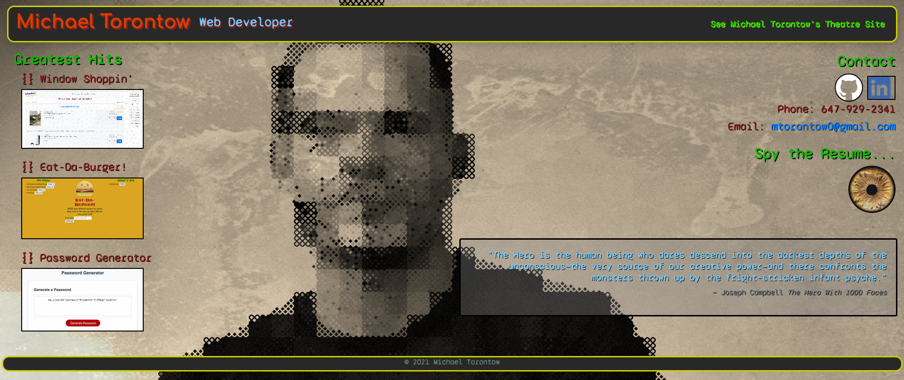

# Michael Torontow's Portfolio

## Description

This is my official web dev portfolio page.

Using Bootstraps facility for creating responsive sites, I made this readable on all types of devices. It features a few of my best achievements in web design, and also links to my actor website since people searching for me may not get to where they think they ought to be!

## TABLE OF CONTENTS

1. [Installation](#Installation)
2. [Usage](#Usage)
3. [Contributing](#Contributing)
4. [Tests](#Tests)
5. [Questions/Contact](#Questions/Contact)
6. [License](#License)
7. [Credits](#Credits)

## Installation

Simply navigate to [https://torontow.github.io/MT-Portfolio/](https://torontow.github.io/MT-Portfolio/).

## Usage

Look around and see what you can click!

## Contributing

If you would like to contribute to this project, please contact me with the information below. You are incouraged to follow the [Contributor Covenant](https://www.contributor-covenant.org/). 

## Tests

There are no included tests for this project. Given that this was my first time working with handlebars.js, I started by creating an index.html to design the view of the site, which I then translated over to the various handlebars files and partials. 

## Questions/Contact

GitHub Profile: [https://github.com/Torontow](https://github.com/Torontow)
Email: [mtorontow0@gmail.com](mailto:mtorontow0@gmail.com)

## License

This project is covered under MIT license.

## License

MIT License

## Credits

Bootstrap (https://getbootstrap.com)
W3 Schools (https://W3schools.com)
Google Fonts (https://googlefonts.com)

 